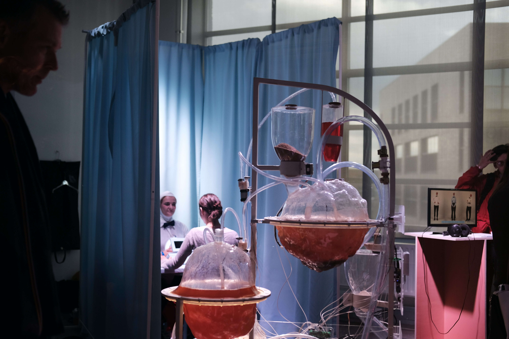

Photo by <a href="https://unsplash.com/@christianfregnan?utm_source=unsplash&amp;utm_medium=referral&amp;utm_content=creditCopyText">Christian Fregnan</a> on <a href="https://unsplash.com/s/photos/experiment?utm_source=unsplash&amp;utm_medium=referral&amp;utm_content=creditCopyText">Unsplash</a>

25% of people stay committed to their New Year's Resolutions for 30 days and only 8% actually accomplish them.

Those are some sad statistics. The New Year is a great reset point to try and integrate new habits into your life and make changes for the better. But as we can see, delivering these promises does not work out for the majority of us.

I'm not one for making New Year resolutions as I think it shouldn’t take a milestone like a new year to make changes in my life but as we enter 2021 I'm going to try something different.

Inspired by people like Tim Ferris and A.J.Jacobs who use themselves as the subject of their own experiments, 2021 for me will be the year of the experiments.

I have chosen 12 experiments, one for each month, that I will be conducting on myself to challenge and hopefully improve my life.

I will be putting daily updates on my [twitter](http://www.twitter.com/craig_dennis3) and at the end of each month I will write a summary on the impact each experiment had on my life.

I have spent some time brain storming what I want to achieve and the kind of experiments that I want to conduct on myself and here is the loose plan.

As we go through the year it is possible that I will change what the monthly experiment is depending on what is going on in my life but this is the rough outline.

**Jan - Run every day**

As part of Red January to help raise money for mental health, the experiment is to exercise everyday. My exercise will be to run everyday.

**Feb - Create a micro-project**

To help improve my knowledge of HTML, CSS and JS I will make a project from this Udemy course. 

[50 Projects In 50 Days - HTML, CSS & JavaScript](https://www.udemy.com/course/50-projects-50-days/)

I will be using the project as a guide and will make them without looking at the tutorial unless I get stuck.

**Mar - No sugar**

I have read a lot about the benefits of cutting sugar out of your diet on your body. I feel like this might be the hardest challenge of the year as I have a weakness to sweet things.

**Apr - Write 200 words a day**

To help improve my writing I am planning on writing at least 200 words a day. This may come in the form of some sloppy writing, depending on how much time I have to edit. But it is the act of writing that I am more interested in. Getting ideas out of my head and onto paper.

**May - Practise Visualisation**

I have read a lot of things of the benefits on visualisation. Thinking about an goal that you have and picturing yourself living that goal everyday. My challenge will be to visualise something everyday and see what happens. Hopefully a month will be enough time to make it come true.

**Jun - Wear blue light blocking glasses for a month**

With the amount of time that I spend in front of a computer screen, I thought I would see if there are any noticeable benefits to wearing blue light blocking glasses.

**Jul - Wake up at 5am everyday**

I think this will also be another challenging experiment, having started this for a week and it about killed me off. This time I will try and go bed early and do what I can to prepare for this hell!

**Aug - Sleep for 8 hours a day**

Probably a fitting experiment following the previous one. I think that most of the time I do not give myself enough sleep to properly function as a human. So this experiment could be considered a treat to my body.

**Sep - Gamble £1 everyday**

This is to see if I can make a career out of gambling. The plan is to gamble £1 a day and see if I can finish the month with more money than I made. Expect to see some football accumulators and some horse racing bets. 

**Oct - Meditate 30 mins a day**

There have been countless studies about the benefits of meditation. I had integrated this into my morning routine before so 30 mins a day should hopefully have a positive impact.

**Nov - Read 30 mins a day**

With my reading goals that I have set myself for 2021, this month will give me the chance to catch up in case I slipped. The 30 minutes may involve making notes on books as well as reading as there is little point reading unless you are note taking.

**Dec - Send messages of gratitude**

This month will tie up nicely with all the festive cheers in the year. The plan is to write a message each day to a person in my life telling them what I'm grateful for. Again I have read countless things about the benefits of this and will be a great theme in time for Christmas.

There we have it. 12 experiments in 12 months. It is easy to put this down in words, the hardest part is executing on this.

Keep an eye out on my [twitter](http://www.twitter.com/craig_dennis3) from January for my daily updates and my [website](http://www.craigdennis.me) for monthly updates on how well the experiment went.

What experiments or New Year Resolutions are you setting yourself?  I would love to hear. Drop me a tweet on [twitter](http://www.twitter.com/craig_dennis3).
