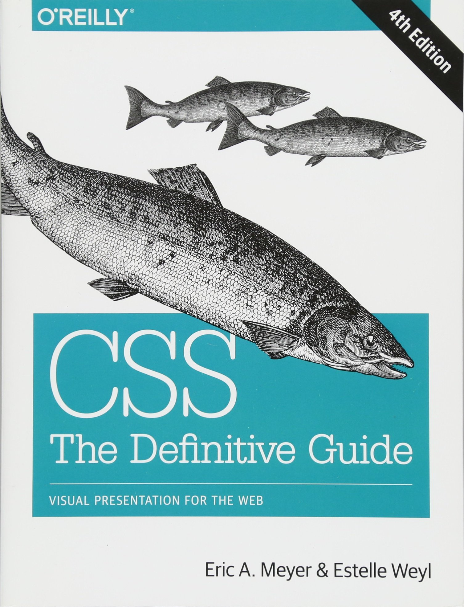
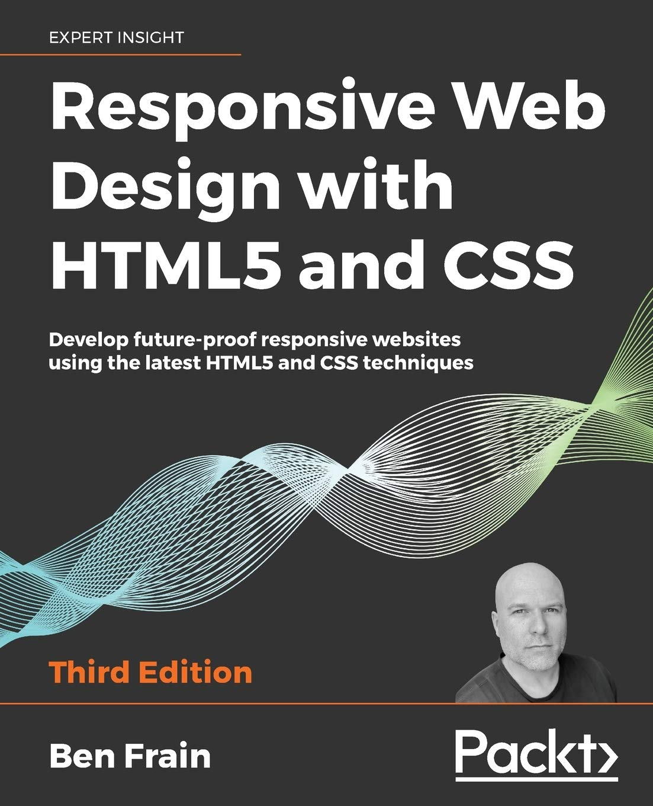
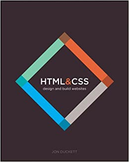
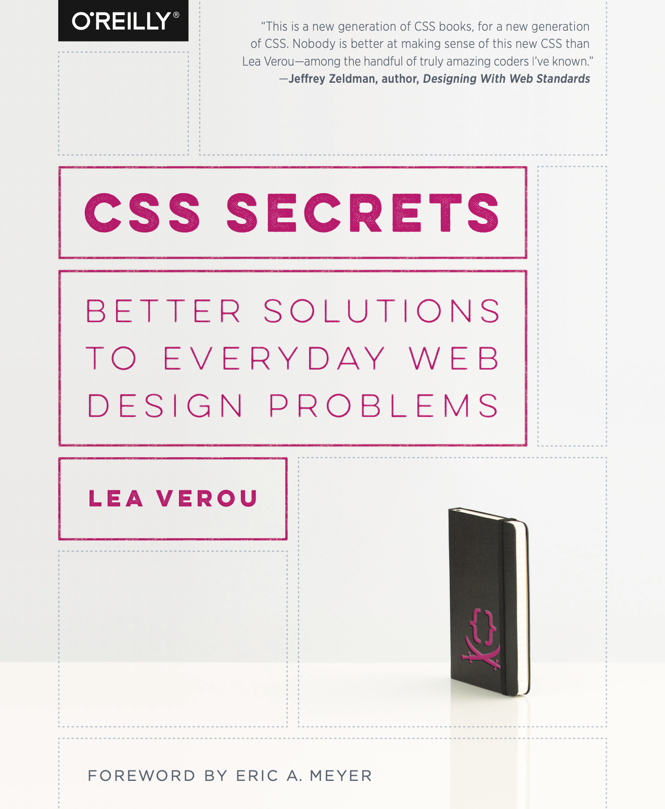

CSS is one of those languages that are easy to learn but hard to master. If you don't believe me a quick search on Quora will find you lots of frustrated people who find CSS tricky, hard, frustrating and difficult, to name a few choice words to describe their experience.

Because I am such a caring and helpful person I have spent some time trawling the internet looking for books that are highly recommended to learn CSS3 from.

Reddit, Twitter and comparison website are a few of the places that I searched looking for the best of the best.

Below are the top 4 CSS3 books recommended by the Internet.

## 4. CSS The Definitive Guide by Eric A Meyer and Estelle Weyl

This book can only be described as a tomb due to its massive length. With over 1000 pages this book contains everything that you need to know about CSS, going into the finest of detail.

This is one of those go to books when you are looking for something. If it not in this book, it does not exist.

Filters, Animation, Flexbox, Grid, Tables. You want it, it's got it. A must have on your shelf for anyone looking to improve their CSS or who wants a great reference book.

It also makes a nice monitor stand.

## 3. Responsive Web Design with HTML5 and CSS by Ben Frain

Responsive web design with HTML5 and CSS approaches your learning of CSS from the angle of  making websites that look great on all screen sizes and making use of all the latest techniques.

Expect lots of Flexbox and Grid as well as some HTML semantics, media queries and some neat tricks to make nice looking designs.

## 2. HTML and CSS by Jon Duckett

Coming in at the second spot is HTML and CSS by Jon Duckett. This book is coding in the form of art. The content is put together to look amazing and easy to learn the concepts.

It also makes it fun to learn and helps internalise what you are learning. I have these books in my collection and are a brilliant jumping off point for anyone wanting to learn CSS as well as HTML.

## 1. CSS Secrets by Lea Verou

The number one most recommended book to learn CSS across the internet is CSS Secrets by Lea Verou. Looking at all the recommendations at the beginning of the book makes it clear that you are going to learn some gold with this book.

This isn't a beginners guide to CSS. The other books can help you with this. This is a book that will show you some of the things that are possible with CSS and help you tackle some of the problems that you run into with everyday design problems.

There it is. The internet has spoken and gave you these four books that you should have in your collection if you want to start your journey with CSS or improve it.

Let me know if you have had experience with these books and what you thought. You can reach out to me on [twitter](http://www.twitter.com/craig_dennis3).