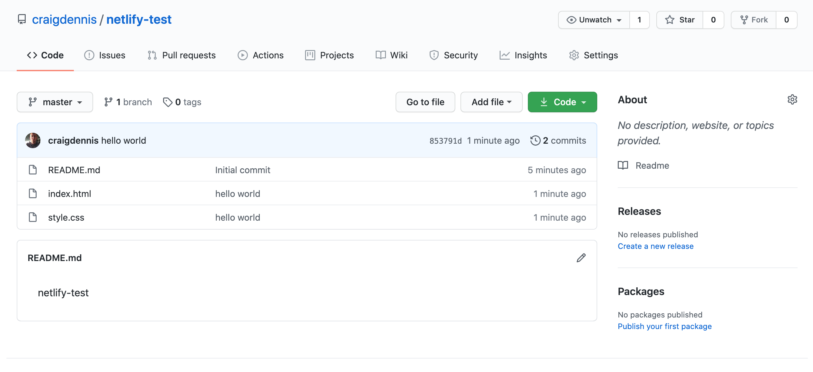
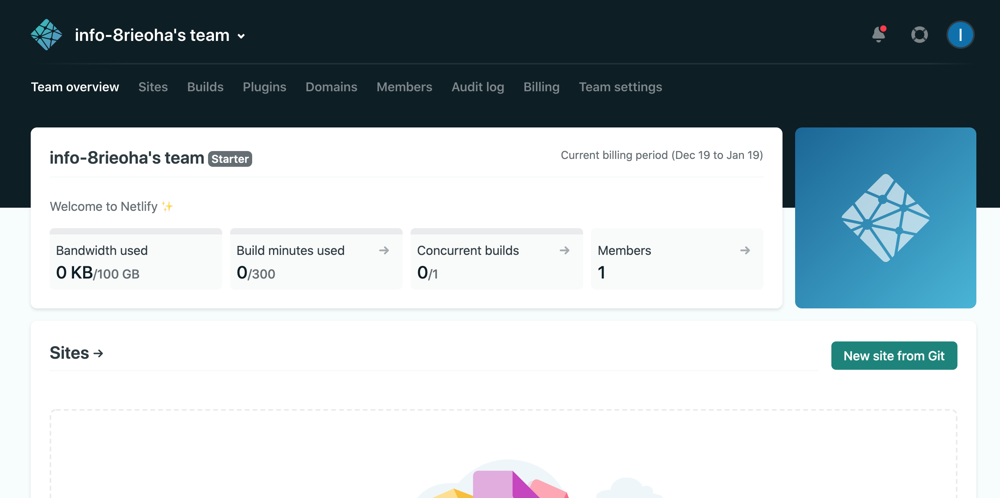
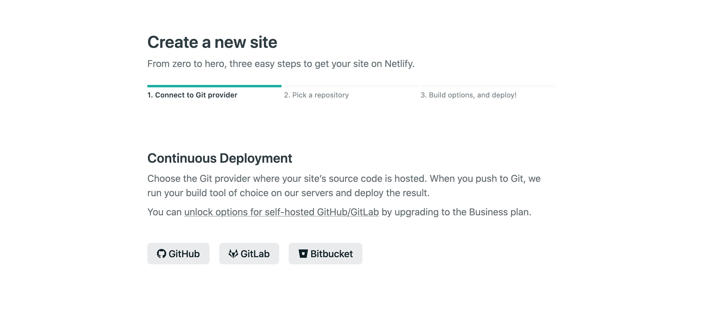
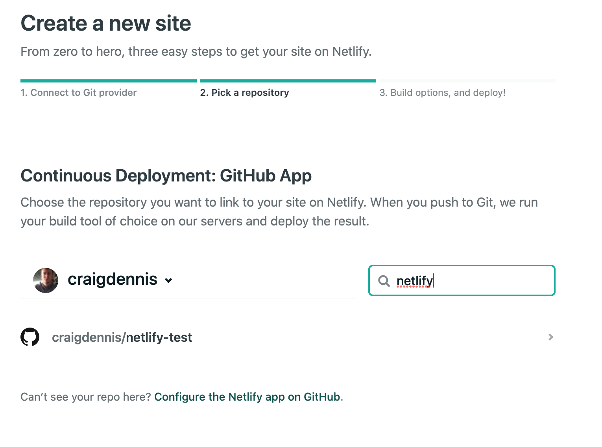
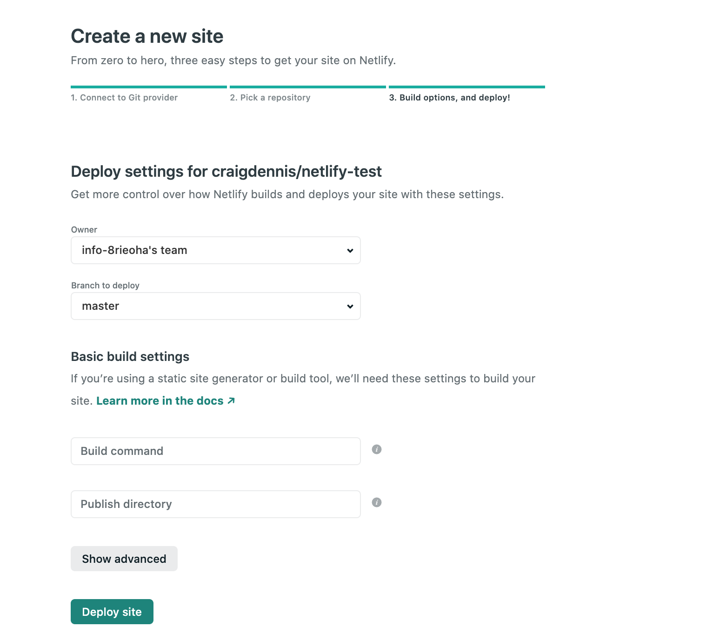
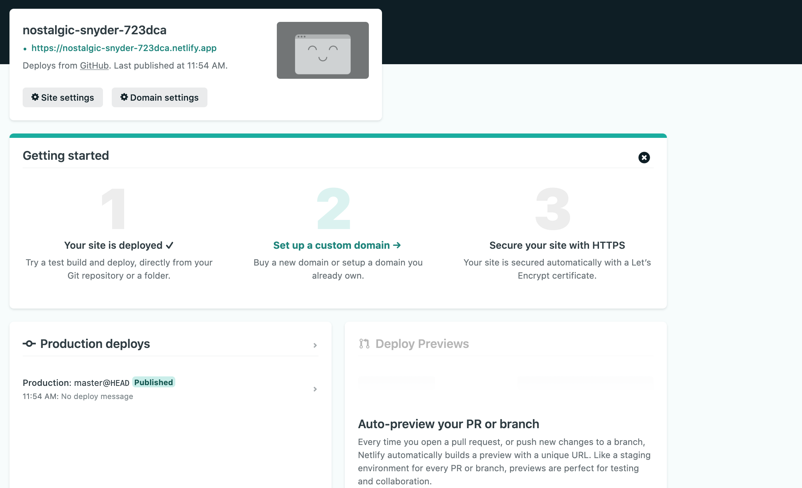
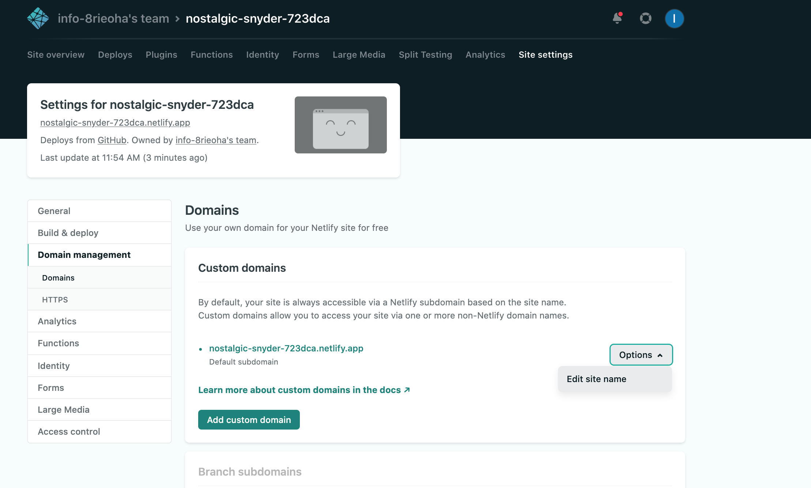
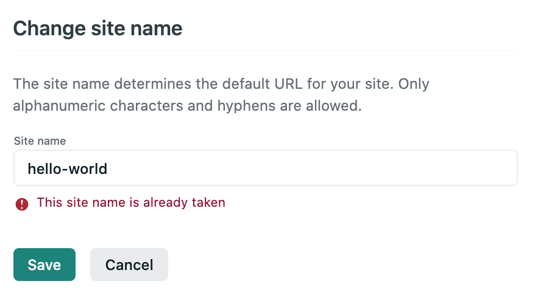

Netlify is one of the quickest ways to get a site up and running. It is what I use when I want to put a project on the Internet. I even use it to host my website, [www.craigdennis.me](http://www.craigdennis.me) as Netlify allows custom domains.

The best part of it all is Netlify is FREE. The free version, at the time of this writing, gives you 100gb bandwidth and 300 build minutes a month.

I have been using Netlify for all of 2020 and have not once passed my months limits. Unless you have a website that is creaming it with visitors and is super popular and is so complex when you need to build it, you should have no problems.

In this article, I will show you how easy it is launching a site on Netlify. We will do this using GitHub.

## Version Control

You say that you aren't using any form of version control? Well, this is a perfect time. The benefits of version control are immense. 

The two main ones for me are your code is safe in the cloud, so if you lose your laptop or it dies, no worries! You download your code on another machine and away you go. 

The second reason is to protect you when you completely screw up your code. This relies on the fact that you have good habits when it comes to committing code. If you do, when you push something live that totally screw things up, version control makes it so easy to revert those changes. Saving your life.

## Action!

Now we have got you onboard it's time to get our site live on Netlfiy.

This requires a few things.

1. Code that you want to go live
2. A Github account
3. A Netfliy account

If you have neither of the above, go make some code and sign up for GitHub [here](https://github.com/) and Netlify [here](http://netlify.com/).

For this article, we are going to launch our hello world website onto the Internet.

What I have done to prep is pushed the code that I want to go live onto GitHub. You can find the codebase [here](https://github.com/craigdennis/netlify-test). (It's nothing to be impressed at 😝)

With your site on GitHub, head over to Netlify to get started.

On the team overview section, it will list all of the sites that you have live and what bandwidth and build minutes you have used.

What we want to do is select "New Site From Git"

Next, we select Git provider where our codebase is. For us it is GitHub, but you do have the options for GitLab and Bitbucket if they are your preference.

Clicking on GitHub will prompt you to login in and to authorise Netlify. Once that is done, we search for the code that we wish to push live.

After selecting your repository you get to select settings for your site. Most of the time I leave this default, but you have options to change which branch to deploy from and if you have any build commands.

Then from there you only need to click "Deploy Site", wait for the website building robots to do their things, and your site is live!

## Changing Domain

At the top, you can see that your site has been given a random URL. In the screenshot ours is [[https://nostalgic-snyder-723dca.netlify.app](https://nostalgic-snyder-723dca.netlify.app/)].

You can set up a custom domain or if you aren't that precious you can change the random words and numbers to something more user friendly.

To do that, go to domain settings and under the options of the default subdomain, you can change it to whatever is available.

If a site has been taken, you will see this error message telling you that it has already been taken.

Once you find an available name, go share your site with everyone. You can see our site live over at  [hello-the-world.netlify.app](http://hello-the-world.netlify.app)

I hope this helps you realise how easy it is to get a site up and running using GitHub and Neflify. And how cheap it is. NO MONIES! I would love to see what sites you have pushed live. Share them with me on my [twitter](http://www.twitter.com/craig_dennis3)!