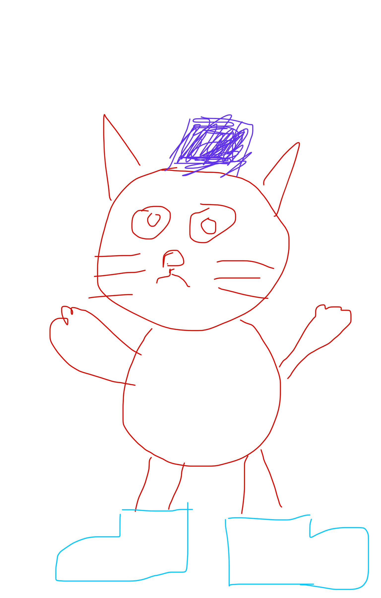

After all that hard work, they had to start again. It had been a couple of weeks since we had given the brief to the developers. And we thought that it was detailed enough.

How we were so wrong.

It was like asking someone to paint the Mona Lisa but we were given this.

It was back to the drawing board.

The first time that this happened, I knew I had to do something about it. It was such a waste of time and resources for both my company and the developers.

It was clear that what we wanted and how it was interpreted was completely different.

If you've had similar experiences hopefully this article will help you get your project done right the first time.

## Spend time working out what you want

This is one of the most critical parts of when you are scoping out a project. Knowing what you want.

Leaving the developer with little to work from will influence them to make their own decisions which could result in an end goal being completely different.

Creating a brief and creating mock-ups will narrow down your ideas of what you want and make it clear from the beginning what is being aimed for.

### Create a brief

Creating a clear brief is a must. Creating it as detailed as you can is a second must.

To start, write out what are the problems you are trying to solve. You can treat this as your north star. When you are working out what is needed in your project, you can relate to your north star and ask the question "Is this needed?"

Another benefit of having the problem/s you want solving written down is that when you pass the brief to the developers they may be able to see another angle on how to solve your problems.

Another tip when it comes to writing a brief is to picture the actions and the pages that would be required.

For example, if you were looking at developing a calendar system for your project the actions that would be required would be to add, save and edit. The pages that the user would access could be a calendar page and an edit page.

Having a list of actions and pages will help prevent anything getting missed.

### Mock-Up to Save Time

Think of a red cat with a purple hat with blue boots. Now take a second and go draw this. Go on, I will wait for you.

Nice and simple right.

Here is my attempt. If your cat looked anything like this then we must be drawing twins lost at birth and we must get in touch.

Most likely, your cat looks nothing like mine. This is how easy ideas can get lost in translation. With no guidance, 20 hours of work later and could end up with something you did not imagine.

This is why mockups are an important tool to use. It reduces wasted time when two creative minds don't link up. It also allows the developer to receive feedback so they know where they went wrong and how to turn in the right direction.

> "Here's a quick mock-up of how I picture your brief. You like? No? You want pink, big fat fonts and a hamburger. No problem!"

With a brief and mockups, you can make sure from the beginning everyone knows what is expected.

## Small Bites

The two most common workflows when working on projects is the Waterflow Method and Agile Method.

### Waterflow

Waterflow methods tend to work where you scope what you want and when it is done you get handed the finished result. At the end, this sometimes can be the only time you get to see what has been worked on.

As per our cat drawing example, it is easy to see how this can be a problem.

### Agile

The agile method works differently, where a project is broken up into smaller projects and worked on in sprints. Sprints usually last for about two weeks.

The benefits are that you get to see what has been worked on allowing you to provide feedback faster avoiding any misunderstandings.

What can be useful is taking your brief and breaking it out into bite-sized chunks. I sometimes take what the minimum required is to get the project in a working state and call that V1 then break the rest into different versions depending on there importance.

Going back to the calendar example. We could have this list of features.

- Add appointments
- Add to calendar function
- Edit appointments
- Send confirmation emails
- Send reminder emails
- Add appointment tags

Which we can break down into different versions.

V1

- Add appointments
- Edit appointments

V2

- Send confirmation emails
- Add to calendar function

V3

- Send reminder emails
- Add appointment tags

From the different version, it is quicker to get something that works and to provide feedback if things have gone somewhat off course.

## Make Time To Test

> **Customer**: "Can you let me know how you are getting on with our work, please? It has been two weeks and we have heard nothing"

> **Developer**: "I don't know how to put this, but we are waiting on you to test it...?"

Sometimes the best person to test what has been developed is you. With the type of work that I deal with having the domain knowledge allows for more thorough testing than what is carried out by the developers.

This is why you should set aside some time yourself to test before anything is pushed live.

This also means that managing your time becomes important. You don't want to be the bottleneck that is preventing the project from going live. Making sure that you liaise with the developers and plan when you need to be available will prevent a you from being the  bottleneck.

## Summary

If you keep these three things in mind it should help you bring your projects out on time without any massive course corrections. I don't think it is possible to hand someone a brief and they get it right first time. If this has happened to you then you are one of the lucky ones.

There is always going to be something that doesn't go to plan, but if you can try and make it as clear as possible to what you want by **creating a brief** and using **mock-ups,** by working on **small bites** and making sure that you are free to **test** then you are well on your way to keep things on track.