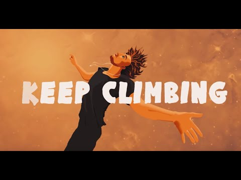
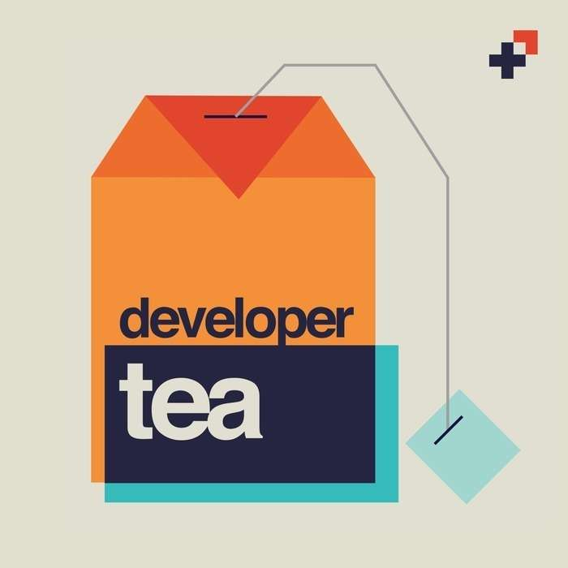
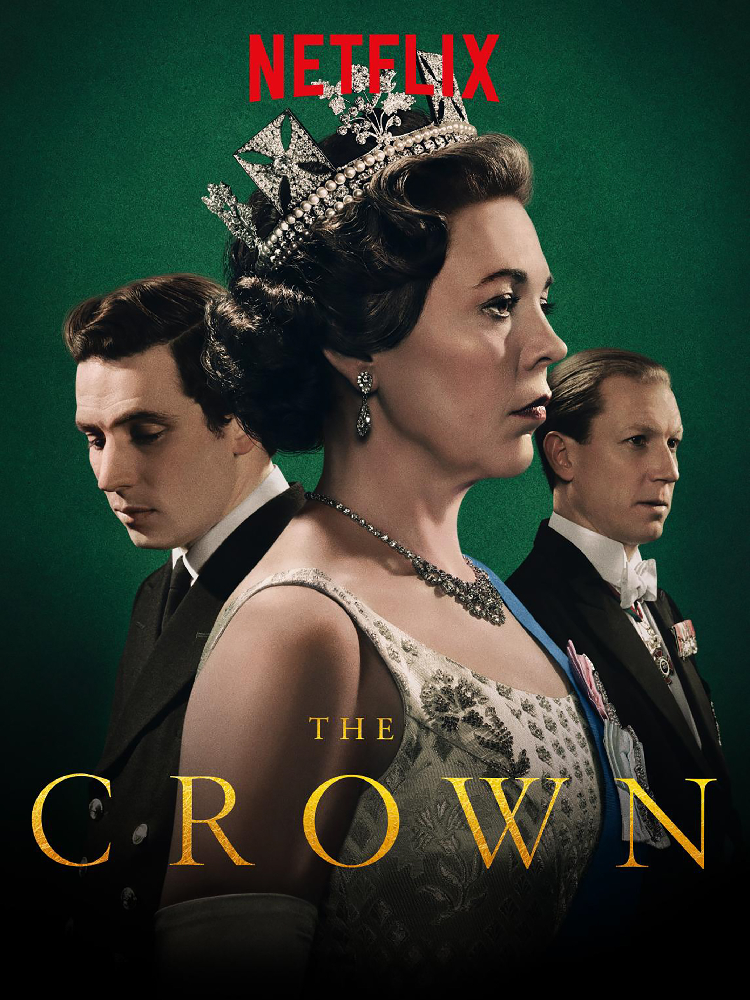

# Welcome

Welcome to Episode 1!

This is the start of my weekly newsletter that will be sent out at 12:00 every Sunday. This is my chance to practise a bit of writing and share you with you some of the interesting things that I have found over the Internet and a way for you to be able to keep up with what I am doing.

Hope you enjoy!

## Sunday Story

I changed a few things and still nothing. Migrating my site wasn’t as straight forward as I thought. Especially when you are going from HTML and CSS to Gatsby.

Two things helped though.

The first was giving myself a head start and the second was asking a friend.

Since I didn’t know what I was doing it was wise to give my self a head start, rather than starting from the very beginning. Gatsby has a library where you can download a starter website. I started with the [a blog](https://www.gatsbyjs.com/starters/gatsbyjs/gatsby-starter-blog/) template.

It was simple. And I could see how I was planning on expanding it.

Now it was the challenge of adding and editing.

When I have been stuck on problems in the past, heading into the wildlands of Google is the best solution. Being able to express your problem in as clear a question as you can is the way to find the best results.

This time, however, I had a problem.

I didn’t know what my problem was! I knew the outcome I wanted, but I lacked the technical terms and how the starter library worked! And it didn't help with the fact that I had never used Gatsby before.

This is when I had to move to my second solution. Ask a friend. I asked my kind friend [Fabio](https://twitter.com/FabioRosado_) if he was able to spread some light on what was going on. He spent some time showing, improving and figuring out my new website.

With his help and a lot of trial and error on my end, the transformation from HTML and CSS to Gatsby was achieved.

The site is now live at [www.craigdennis.me](notion://www.notion.so/www.craigdennis.me). It is still a work in progress so I will share my updates with you as I go.

With this change, it will make publishing my articles to my site so much easier. And fast! It's super fast!

Remember.

Where you can, make things easy for yourself. You don’t get a gold medal from starting from scratch. It’s the results that matters.

And ask for help. It speeds things up a lot!

## 📃 Article

[https://yen.fm/build-newsletter/](https://yen.fm/build-newsletter/)

This is quite a timely article seeing as this is episode 1. Lots of helpful advice on how and why you should start your newsletter. Create a corner of the internet for yourself and share.

## 🎵 Song - Keep Climbing - Cobi

[https://www.youtube.com/watch?v=Xe12tI79hMI](https://www.youtube.com/watch?v=Xe12tI79hMI)

This was a track that I came across when listening to my station on Apple Music. I find it uplifting and powerful. Check out his live acoustic version [here](https://www.youtube.com/watch?v=J7cRAx6RLD8). Such a voice!

## 🎧 Podcast

[https://spec.fm/podcasts/developer-tea/X5XzqN7P](https://spec.fm/podcasts/developer-tea/X5XzqN7P)

Kent C Dodds talks about the value of teaching and why you should be doing to it improve your learning.

## 📺 What I’m watching

The Crown

Even though I’m from the UK, I don’t have hardly any knowledge of the Royal family apart from the main events in the mainstream news. The Crown is a very well produced show visiting the history (based on some fact, maybe?) of the Royal Family. I don’t know why, but it's captivating. And Hans Zimmer wrote the soundtrack. Bonus!

## 📖 What I'm Reading

[Writing for Software Developers by Philip Kiely](https://gumroad.com/philipkiely#uZPZU)

With my interest in writing and producing technical content to help people, Philip's book looked exactly what I was after. I am about halfway through and found some golden nuggets to help me create my content.

Here are some snippets that I’ve highlighted from the book.

> "You should write one-year articles for your clients and publish ten-year articles for yourself.”

> “I am more intentional now in writing to position my pieces as essays rather than blog posts, because essays have an anchor around timelessness and blog posts have an anchor around - Patrick McKenzie"

> “You start with that super high-level explanation of the goals of doing this, and then you continue unwrapping the onion one layer at a time until you get to the very nub of it where you’re showing people actual code snippets. — Patrick McKenzie”

> “The outline is one of several steps in the writing process where you decide what to leave out of the article”

> “For an article, good clean code is concise but easy to understand; you should optimize for readability first”

---

That's all folks!

If you want to catch up with my goings-on throughout the week, head over to my [twitter](notion://www.notion.so/www.twitter.co./craig_dennis3).

Peace out!

Craig x