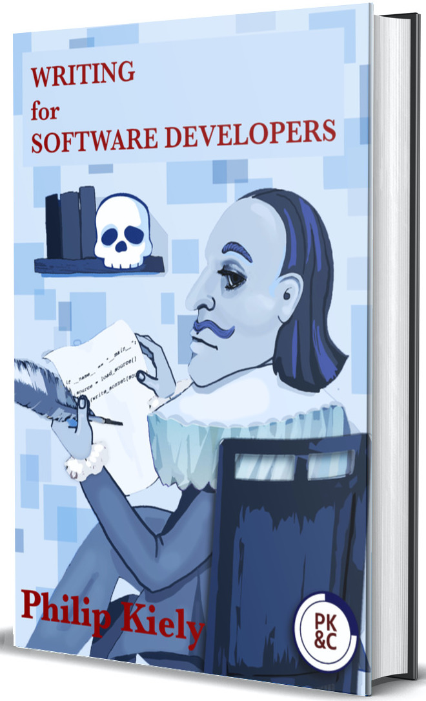

# Welcome

Welcome to Episode 2. Being part of communities is fun, isn't it. Black Friday inspired me to join a few to gather with people who are looking to improve on the same things that I am trying to do. It is great to be learning in the trenches with other people like you and share what we learn together. If you aren't already, get started. There are  communities that you can join for free. Doing a quick google with the kind of community you are looking for plus "discord" will bring you up some result.

For example "front end developer discord" or "weightlifting discord"

Let me know what communities you have joined on [twitter](notion://www.notion.so/www.twitter.com/craig_dennis3) with the below link.

[Tweet to @craig_dennis3](https://twitter.com/intent/tweet?screen_name=craig_dennis3&ref_src=twsrc%5Etfw)

## Sunday Story

My pocket keeps on filling up. As soon as I take something out of it, more just keeps getting added. These are not my jeans pockets. I am talking about the app [Pocket](https://app.getpocket.com/).

This is the app where I save articles that I find interesting that get shared in the private communities that I am part of, newsletters that I am signed up for and RSS feeds from websites that I follow.

From the number of articles that I have saved it, it is clear that I am having a tough time limiting consuming.

It doesn't matter the number of good articles that you have unless you are reading them and spending time developing upon the idea and internalizing it into something that is yours. Unless of course, your goal is entertainment.

This is something that I'm trying to improve. With my focus on writing it is more important to take the raw materials from articles and use that as a form of idea creation.

This is where I am going to use a simple system of read, highlight then create.

It is as simple as **read** whatever article I have saved, **highlight** sections that stand out and mean something to me or are a thread to something that I have been currently thinking, then **create** notes from them. Expanding on the subject, putting into my own words and comparing them to my own experiences.

It is no good reading loads without a system in place to capture thoughts unless you are reading for fun. I don't know about you, but I have not yet discovered I have a photographic memory and somehow doubt I will find this out as I grow older.

With this it should allow me to gather the gold from what I am reading and turn it into something I can share and learn from.

Remember, it is ok to gather information but make sure that you take the time to process it. Or ask yourself, what is the point?

## 👏 Self Promotion

[https://www.craigdennis.me/What-I-Learnt-Making-A-Guess-The-Number-Game/](https://www.craigdennis.me/What-I-Learnt-Making-A-Guess-The-Number-Game/)

This week I posted an article about what I've learnt from making a guess the number game. Here are some of the things you can learn from the article.

- Element selector
- Random number
- Event listeners
- Get value from user input

## 📝 Article

[https://letter.substack.com/p/stages-of-the-builders-journey-a](https://letter.substack.com/p/stages-of-the-builders-journey-a)

If you are looking to be a creator than this article has some useful advice. Here are some of the highlights.

> Don’t wait until you have a big following (i.e. start now)

> Put yourself out there (i.e. publish)

> Time box the effort (i.e. give yourself a deadline)

## 🎧 Podcast

[https://dannymiranda.com/031-harry-dry/](https://dannymiranda.com/031-harry-dry/)

Brilliant interview with Harry Dry who made a dating website for Kanye West fans and runs the website Marketing Examples, writing quality write-ups of marketing examples. 

## 🎵 Song - Honeybody by Nu Deco Ensemble and Kishi Bashi

This track is so full of delight and jive. Perfect song to get your energized and raring to go. Right head bobber.

## 📖 What I'm Reading

[Writing for Software Developers by Philip Kiely](https://gumroad.com/philipkiely#uZPZU)

This is another week of reading Writing for Software Developers. There is so much content in this book that is useful for people looking to write technical articles. Here is another batch of my highlights from the book.

> I achieved this through a combination of probing one level deeper into established answers and applying new information to contextualize old questions

> Outlining relies on your ability to take a large idea and factor it out into discrete components

> You start with that super high-level explanation of the goals of doing this, and then you continue unwrapping the onion one layer at a time until you get to the very nub of it where you're showing people actual code snippets - Patrick Mckenzie

> “For an article, good clean code is concise but easy to understand; you should optimize for readability first”

> “just get the words on the page. It will be much easier to adjust your work when you have a piece to edit.”

---

That's all folks!

If you want to catch up with my goings-on throughout the week, head over to my [twitter](notion://www.notion.so/www.twitter.co./craig_dennis3).

Peace out!

Craig x